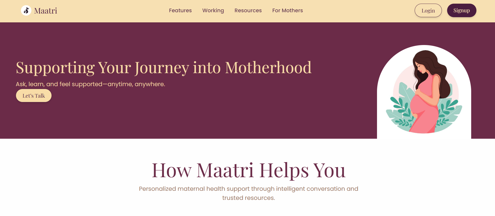
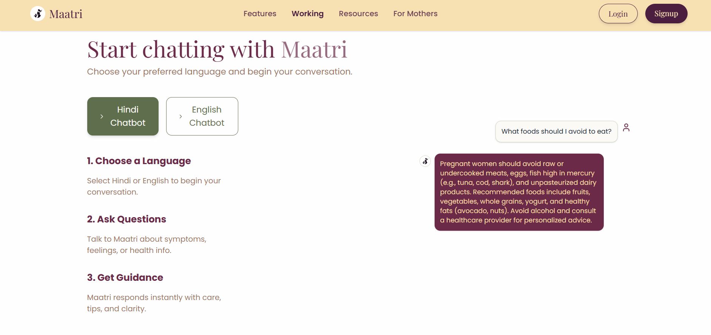
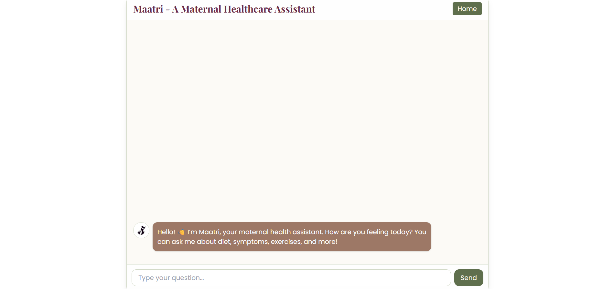
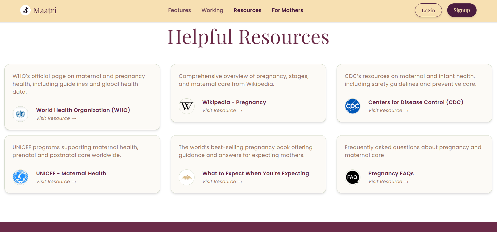
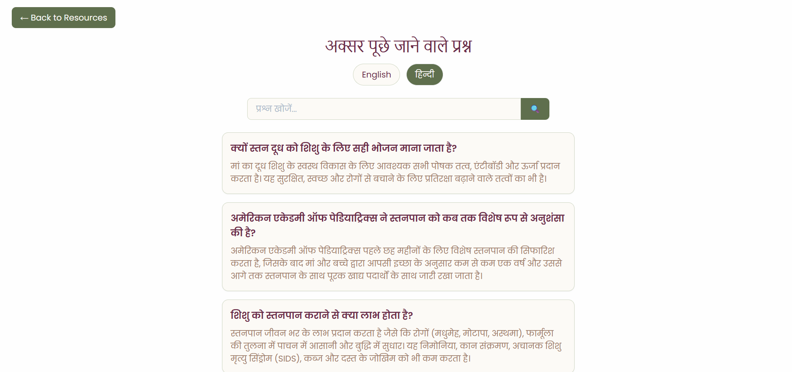

# Maatri – Maternal Health Assistant  
*A bilingual pregnancy assistant for English and Hindi users.*
---

## 🧭 Overview  
**Maatri** is a bilingual (English + Hindi) maternal health assistant that helps expecting mothers by providing reliable, empathetic, and context-aware answers using a Retrieval-Augmented Generation (RAG) system.

The system includes:
- 🔍 **Hybrid Retrieval System** using Sentence Transformers + FAISS  
- 🧠 **Reranking using Cross-Encoder**  
- ✨ **Generation and Abstractive Summarization** for natural conversational answers  
- 🌐 **React Frontend** with modern UI  
- ⚡ **FastAPI Backend** for both English & Hindi chatbots  
- 📚 **Extensive curated FAQs** in English & Hindi  

---

## 🚀 Features  

### 🤖 Chatbot (English + Hindi)
- Friendly conversational interface  
- Accurate, evidence-based answers  
- Sources shown on demand  
- Loading animations + smooth UI  

### 📚 FAQ Module  
- Toggle between English and Hindi  
- Live search suggestions  
- Easy-to-read collapsible cards  

### 🎨 Frontend  
- Built using **React + Tailwind CSS**  
- Fully responsive  
- Warm theme aesthetic  
- Includes Hero section, Features section, Resources page and more  

### ⚙️ Backend  
- **FastAPI** for high-performance async API  
- **Multi-Model Integration**:  
  - Bi-encoder (SentenceTransformer)  
  - Cross-encoder for ranking  
  - LLM for final natural language responses  
- **FAISS vector search**  
- **Caching for faster response time**

---

## 📁 Project Structure  
Maatri/
  Frontend/
    virtualr-main/
      src/
        components/
          EnglishChatbot.jsx
          HindiChatbot.jsx
          Faqs.jsx
          Navbar.jsx
          HeroSection.jsx
          Resources.jsx
          FeatureSection.jsx
          Workflow.jsx
          Pricing.jsx
          Testimonials.jsx
          Footer.jsx
        assets/
        index.css
        main.jsx
      public/
        data/
          faqs_english.json
          faqs_hindi.json
      package.json
      vite.config.js

  english_chatbot/
    app.py
    requirements.txt
    models/
      fine_tuned_cross_encoder/
      english_embeddings/
      faiss_indexes/
      LLM/

  hindi_chatbot/
    backend/
      app.py
      rag.py
      crossencoder.py
      models_io.py
      config.py
    embeddings/
      merged_corpus_embeddings.npy
      merged_corpus_faiss.index
      merged_corpus_meta.json

  README.md


---

## 🌟 Features

### 🗣️ **1. Conversational AI (Hindi + English Chatbots)**
- Retrieval-augmented generation (RAG)
- Handles pregnancy health, nutrition, symptoms, risks, lifestyle, etc.
- Generates empathetic and medically-safe replies with disclaimers

### 🔍 **2. Hybrid Retrieval Pipeline**
- SentenceTransformer bi-encoder → FAISS vector search  
- Cross-encoder reranking  
- Top-K contextual passages passed to generator model  
- Supports English & Hindi separately  

### 📝 **3. FAQ System (English & Hindi)**
- Browse curated questions  
- Live search suggestions  
- Language toggle  
- Clean UI using Tailwind CSS  

### ⚡ **4. Modern Frontend (React + Tailwind)**
- Fully responsive  
- Smooth animation and UI transitions  
- Components neatly organized  

### 🚀 **5. FastAPI Backend**
- Async endpoints  
- Efficient model loading  
- Works with both CPU and GPU setups  
- CORS-enabled for frontend communication  

---

## 🛠️ Installation & Setup

###  1. Clone Repository
```bash
git clone https://github.com/Chaitanya-Wanjari/Maatri.git
cd Maatri
```
### 2. Setup Frontend
```bash
cd Frontend/virtualr-main
npm install
npm run dev
```
 App will run at: http://localhost:5173
### 3. Setup English Chatbot API
```bash
cd english_chatbot
pip install -r requirements.txt
uvicorn app:app --reload --port 8000
```
### 4. Setup Hindi Chatbot API
```bash
cd hindi_chatbot/backend
pip install -r requirements.txt
uvicorn app:app --reload --port 8001
```
### 5. API Endpoints 
English Chatbot
```bash
POST http://localhost:8000/ask
Body: { "question": "Your question" }
```
Hindi Chatbot
```bash
POST http://localhost:8001/ask
Body: { "question": "आपका प्रश्न" }
```
### Home Page



### Friendly conversational interface


### English Chatbot


### Resources


### FAQ Page



